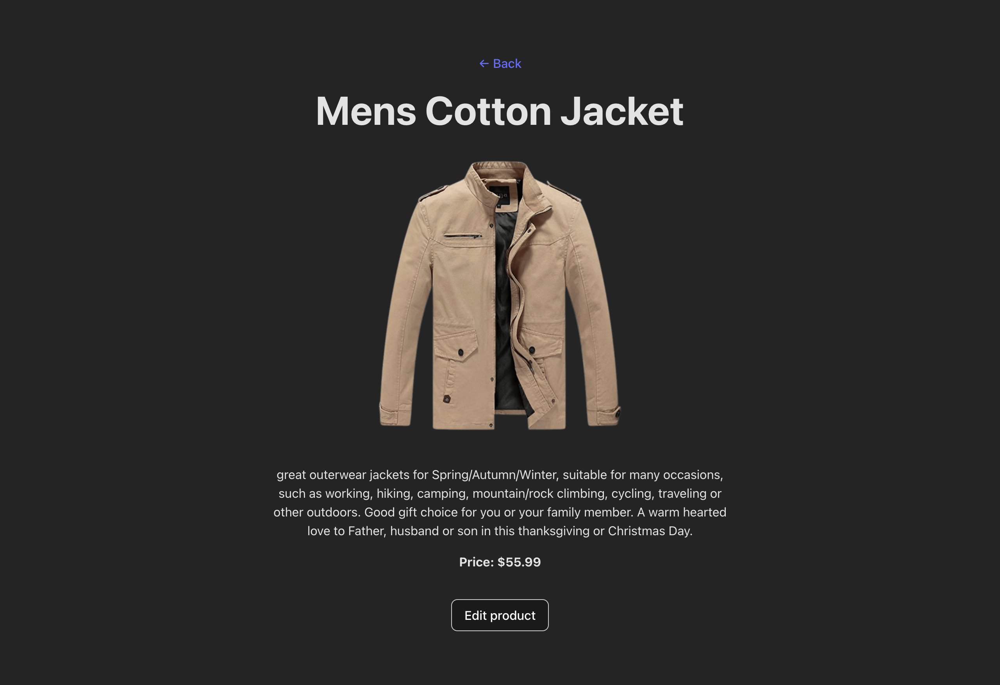

# List of Cards -- Products Manager

SPA-приложение для работы со списком продуктов: просмотр, лайки,
удаление, фильтрация, поиск, пагинация, создание и редактирование
карточек.



## 🚀 Деплой

[Ссылка на деплой на Vercel](https://)

---

## 📌 Функционал

- Просмотр списка продуктов `/products`
- Лайк карточки (с сохранением в store)
- Удаление карточки
- Фильтрация: все / избранные
- Обрезка описания на карточках для одинаковой высоты
- Переход на страницу продукта `/products/:id`
- Создание продукта `/create-product`
- Редактирование продукта `/edit-product/:id`
- Сохранение данных в Zustand (persist)

---

## 🛠 Стек технологий

Технология Назначение

---

**React + TypeScript** UI и типизация
**Zustand (persist middleware)** Store для продуктов
**React Router** Маршрутизация
**React Hook Form + Zod** Формы и валидация
**Vite** Сборка проекта

---

## 🔗 API

Для получения списка продуктов используется публичный API:\
`https://fakestoreapi.com/products`

Созданные и отредактированные продукты сохраняются в локальном Zustand
store.

---

## 📂 Структура проекта

    src/
     ├─ components/
     │   └─ ProductCard.tsx
     ├─ pages/
     │   ├─ ProductsList.tsx
     │   ├─ ProductPage.tsx
     │   ├─ CreateProduct.tsx
     │   └─ EditProduct.tsx
     ├─ store/
     │   └─ useProductsStore.ts
     ├─ App.tsx
     └─ main.tsx

---

## ▶️ Установка и запуск

```bash
git clone https://github.com/Yaroslav-Chertov/list-of-cards
cd list-of-cards
npm install
npm run dev
```

Открыть в браузере:\
http://localhost:5173/

---

## 🌟 Возможные улучшения

- Сортировка по цене / алфавиту\
- Skeleton-загрузка\
- Темная тема\
- Модалки для создания/редактирования
